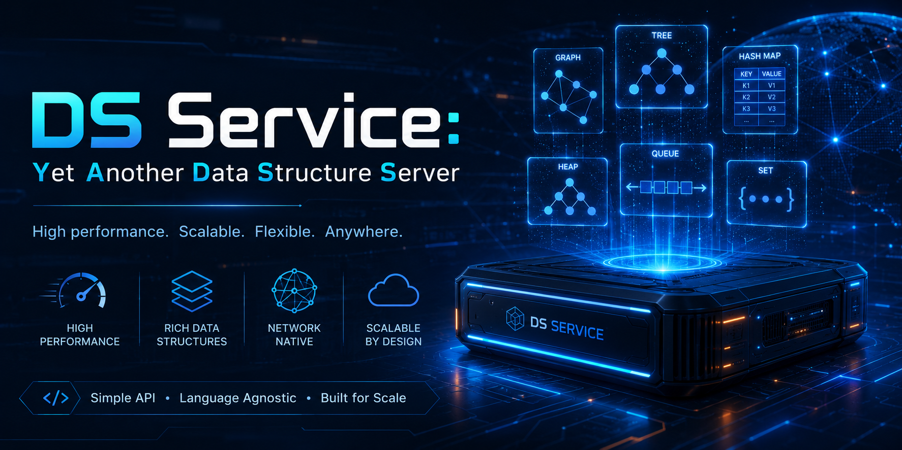

# ds-service: Yet Another Data Structure Server



`ds-service` is a small, in-memory data structure server that is accessible via [gRPC](https://grpc.io/).

`ds-service` runs a single server process
that holds shared state in memory
and lets many distributed clients and workers coordinate using it.

Presently, it provides six things:
- **A key-value store** -- a shared `string -> bytes` store
    for passing data between processes.
- **A task queue** -- a priority-based work queue
    that distributes tasks to workers and tracks their state.
- **A journal store** -- append-only, ordered logs of binary entries.
- **A time series store** -- append-only series of
    timestamped floating-point values.
- **Named mutexes** -- cooperative locks
    for coordinating exclusive resource access across workers.
- **Counters** -- named monotonic counters
    that hand out successive integers.

Each of these is a separate key space with its own set of RPCs.
See [docs/data-structure-reference.md](docs/data-structure-reference.md)
for what every RPC does and the exact semantics of each structure.

## Architecture

- **Server** (`cpp/ds-service.cpp`) -- a C++23 gRPC service.
    All state lives in memory,
    with a separate lock guarding each top-level data structure.
    Operations on one structure are serialized,
    while operations on different structures may run concurrently.
    Each RPC touches a single structure,
    so no request ever holds more than one lock.
    State is **not** persisted;
    that is, when the server stops all data is lost.
- **Client** (`python/ds_service_client/`) -- a Python 3.12+ client library
    that wraps the generated gRPC stubs
    and translates gRPC status codes into Python exceptions
    (`KeyError`, `ValueError`, `TimeoutError`).
- **Interface** (`misc/ds-service.proto`) -- the protobuf/gRPC contract
    shared by both sides.

## Building and running the server

Dependencies are managed with [Conan](https://conan.io/)
and the build is driven by CMake:

```sh
conan install . --build=missing
. build/Release/generators/conanbuild.sh
cmake -S . -B build/Release \
    -DCMAKE_BUILD_TYPE=Release \
    -DCMAKE_TOOLCHAIN_FILE=generators/conan_toolchain.cmake
cmake --build build/Release --parallel

build/Release/ds-service --address 0.0.0.0:5051
```

See [docs/howto-build-the-server.md](docs/howto-build-the-server.md)
for the requirements, what each step does, installing,
and the container build.
A Debian package can be built as well --
see [docs/debian-packaging.md](docs/debian-packaging.md).

## Python client

```sh
pip install ds-service-client
```

```python
from ds_service_client import Client

client = Client("127.0.0.1:5051")  # or set DS_SERVER_ADDRESS and call Client()

client.map_set("greeting", b"hello")
assert client.map_get("greeting") == b"hello"
```

See [docs/howto-use-the-python-client.md](docs/howto-use-the-python-client.md)
for connecting, the gRPC-status-to-exception mapping,
and worked examples of every data structure.

## Running the tests

The test suite (`tests/`) is an integration suite driven by
[pytest](https://pytest.org/): it starts a fresh `ds-service` process
for each test and drives it through the Python client.
[Build the server](docs/howto-build-the-server.md) first
(the tests run the compiled binary), then:

```sh
pip install -e ".[test]"                      # pytest + the client package
export DS_SERVICE_BIN=build/Release/ds-service
python -m pytest
```

See [docs/howto-run-the-tests.md](docs/howto-run-the-tests.md) for
running individual tests, how the binary is located,
and what the fixtures provide.

## License

MIT -- see [LICENSE](LICENSE).
